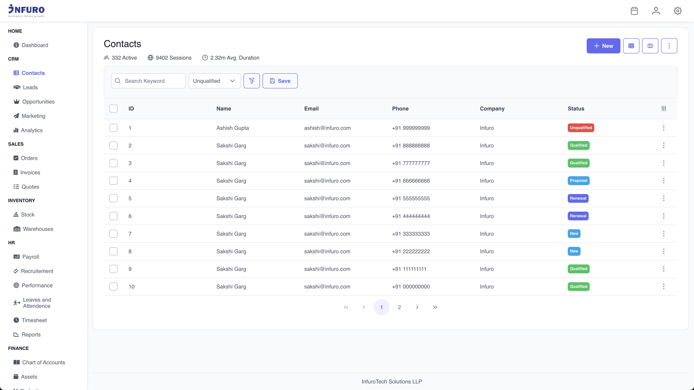

# ERP System Boilerplate (MEAN Stack)

Welcome to the ERP System Boilerplate! This project provides a scalable and modular foundation for building ERP systems using the MEAN stack (MongoDB, Express, Angular, NestJS). It includes PrimeNG for the UI and TypeORM for backend ORM. Additionally, it uses Yeoman generators to streamline code generation and customization.



### Features
* **MEAN Stack:** Fully integrated architecture.
* **NestJS:** Modular and structured backend with TypeORM for database interaction.
* **Angular + PrimeNG:** Responsive UI components for building professional-grade user interfaces.
* **Code Generation:** Automated code scaffolding using Yeoman generators.
* **Customizable Modules:** Easily add, edit, or remove modules with minimal effort.
* **Authentication:** JWT-based user authentication and role management.
* **Localization:** i18n support for multiple languages.
* **Scalable Structure:** Clean separation of concerns for maintainable code.

### Prerequisites
Ensure you have the following installed:

* Node.js (>= 16.x)
* Angular CLI (>= 15.x)
* NestJS CLI (>= 9.x)
* Yeoman CLI (npm install -g yo)
* MongoDB or any SQL database supported by TypeORM

## Installation

#### 1. Clone the repository:

```bash
git clone https://github.com/infurotech/erp.git
cd erp
```

#### 2. Install dependencies:
Backend:

```bash
cd backend
npm install
```

Frontend:
``` bash
cd frontend
npm install
```

#### 3. Environment Configuration:
Backend:
Create a .env file in the backend directory:

```
DATABASE_TYPE=postgres
DATABASE_HOST=localhost
DATABASE_PORT=5432
DATABASE_USERNAME=your_db_user
DATABASE_PASSWORD=your_db_password
DATABASE_NAME=erp_db
JWT_SECRET=your_jwt_secret
```

Frontend:
Modify environment.ts in the frontend/src/environments folder to configure API endpoints:

```typescript
export const environment = {
  production: false,
  apiUrl: 'http://localhost:3000/api',
};
```

#### 4. Start the Application:

Backend:

```
cd backend
npm run start:dev
```

Frontend:

```
cd frontend
ng serve
```

Access the app at http://localhost:4200.

## Project Structure

### Backend (/backend)

* **Modules:** Each module (e.g., users, products) is organized under the src folder.
* **TypeORM:** Define entities, repositories, and services for database interaction.
* **Controller:** Handle API endpoints for each module.

### Frontend (/frontend)
* **Modules:** Each feature has its own module (e.g., users, dashboard).
* **PrimeNG:** Pre-styled UI components.
* **Global Components:** Shared components like TableComponent and FormComponent.

Code Generation with Yeoman
Install the Yeoman Generator

```
npm install -g generator-erp
```

Generate a New Module

To generate a new module (backend and frontend):

```
yo erp:module <module-name>
```

This will:

* Create backend services, controllers, and entities.
* Create frontend components, routing, and services.

Example:

```yo erp:module inventory```

Output:

Backend:
* >src/modules/inventory

Frontend:
* >src/app/modules/inventory

Generate a Component in Frontend

```
yo erp:component <component-name> --module <module-name>
```
Example:

```
yo erp:component inventory-table --module inventory
```

### Adding Custom Modules

#### Backend

1. Generate a module using Yeoman or manually create it under src/modules.
2. Define an entity in entities folder.
3. Add service and controller for the module.
4. Register the module in app.module.ts.

#### Frontend

1. Add a new module under src/app/modules using Yeoman.
2. Create UI components using PrimeNG.
3. Configure routes in app-routing.module.ts.

### Best Practices

* **Modular Design:** Use the module structure for both frontend and backend to ensure scalability.
* **PrimeNG Components:** Leverage PrimeNG's powerful UI components for tables, forms, and charts.
* **Localization:** Use Angular's @angular/localize for multilingual support.
* **Backend Validation:** Use class-validator decorators in DTOs for backend input validation.
* **TypeORM Relations:** Define proper entity relationships for database consistency.

### Roadmap
Add more Yeoman templates for frequently used features.
Implement advanced reporting dashboards.
Enhance authentication with OAuth2 support.
Add real-time notifications using WebSockets.

### Contributing
We welcome contributions! Please follow these steps:

#### Fork the repository.
* Create a feature branch.
* Commit your changes.
* Submit a pull request.

For any queries or suggestions, please contact erp@infurotech.com